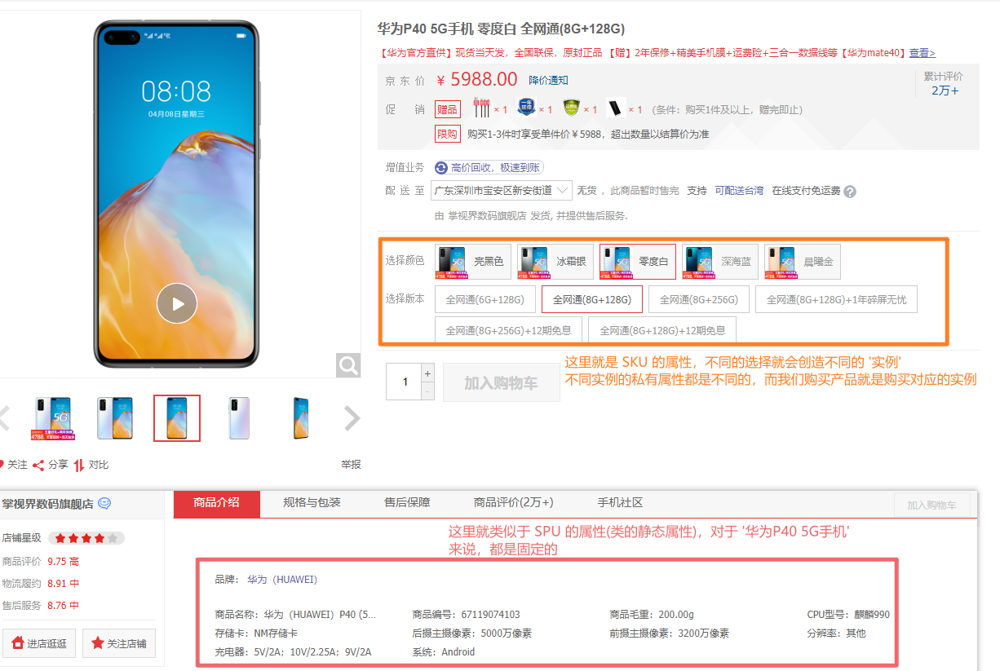
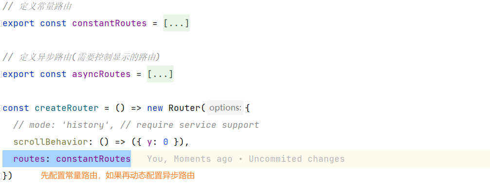

# sph-admin

## 项目介绍

简介：基于 [vue-admin-template](https://github.com/PanJiaChen/vue-admin-template) 二次开发的后台管理系统

后端 Swagger 在线接口文档：

- http://39.98.123.211:8170/swagger-ui.html
- http://39.98.123.211:8216/swagger-ui.html

技术点：

- Vue
- ElementUI
- Echarts
- Moment(处理日期时间)
- 概念：SPU & SKU

## 基础知识补充 

### 深拷贝与浅拷贝

TODO：https://segmentfault.com/a/1190000018874254

### 动态添加响应式属性

前提：目标对象也是响应式的

使用：通过 **Vue.set(target, index/propName, value)** 

作用：向 target 响应式对象中添加一个 prop，并确保这个 prop 同样是响应式的，会触发视图更新

### 深度选择器

> scoped 属性

作用：样式只对当前组件有效

原理：给当前组件的所有标签都加上一个自定义属性 `data-v-xxxx`

注意：如果出现了父子组件的关系，那么 **子组件的根标签** 也会有一个父组件的 `data-v-xxxx` (所以有的时候会被影响)

> 目标：通过在父组件 scoped 属性的样式可以修改子组件中除了根标签外的标签

解决：使用 **深度选择器**

```css
/* 原生 CSS */
>>> h3 {}

/* Less */
/deep/ h3 {}

/* Sass */
::v-deep h3 {}
```

## 业务逻辑扩展

### SPU & SKU

> SPU：标准化产品单元

类似于面向对象中的**类**，是一个 **标准化的信息集合**，这个信息集合可以理解为类的 **静态属性**

以 **华为P40 5G手机** 为例，它就是一个 SPU，它的静态属性就是 **[ 品牌：华为; CPU: 麒麟990 ...]** 而这些属性是可以标识它这个产品的

> SKU: 库存量单位

类似于面向对于中的 **对象**，在具有类的静态属性的同时，还有自己的一些特质的 **私有属性**

还是以 **华为P40 5G手机** 为例，我们将它的私有属性设置为 **[ 颜色: 零度白; 版本: 全网通(8G + 128G) ]** 就能确定一个具体的商品



### Vue 使用 Echarts

1. 安装依赖 

   ```powershell
   npm install --save echarts
   ```

2. 在组件中引入

   ```javascript
   import echarts from 'echarts'
   ```

3. 在组件挂载 `mounted()` 之后初始化 echarts

   ```javascript
   mounted() {
       this.saleEchart = echarts.init(this.$refs['sale-charts'])
       this.saleEchart.setOption({
           title: {
               text: '销售额趋势'
           },
           tooltip: {
               trigger: 'axis',
               axisPointer: {
                   type: 'shadow'
               }
           },
           grid: {
               left: '3%',
               right: '4%',
               bottom: '3%',
               containLabel: true
           },
           xAxis: [
               {
                   type: 'category',
                   data: ['一月', '二月', '三月', '四月', '五月', '六月', '七月', '八月', '九月', '十月', '十一月', '十二月'],
                   axisTick: {
                       alignWithLabel: true
                   }
               }
           ],
           yAxis: [
               {
                   type: 'value'
               }
           ],
           series: [
               {
                   name: 'Direct',
                   type: 'bar',
                   barWidth: '60%',
                   data: [10, 52, 200, 334, 390, 330, 220, 88, 99, 110, 76, 99]
               }
           ]
       })
   }

### Vue Router 动态切换路由

1.  `router/index.js` 中拆分静态路由和动态路由

   

2. 在获取用户信息(UserInfo)时需要和后端数据搭配，**筛选出用户可以访问的路由**

   ```javascript
   import { resetRouter, constantRoutes, asyncRoutes } from '@/router'
   import router from '@/router'
   
   
   
   // ----mutations
   // 获取可以访问的路由配置信息
   state.canVisitRoutes = constantRoutes.concat(filterInvalidRoutes(userInfo.routes))
   // 添加新路由
   router.addRoutes(state.canVisitRoutes)
   // ----mutations
   
   
   
   
   /*
   * targetRouters - 需要过滤的数组
   * */
   const filterInvalidRoutes = function(targetRoutes, ar = asyncRoutes) {
       return ar.filter(item => {
           if (item.children && item.children.length > 0) {
               item.children = filterInvalidRoutes(targetRoutes, item.children)
           }
           return targetRoutes.indexOf(item.name) !== -1
       })
   }
   ```

   注意：这里需要和后端协商好，数据库中需要记录的是**路由的 Name**，以便筛选

   